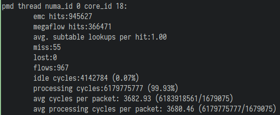
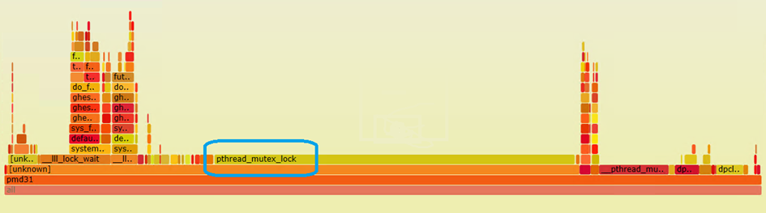
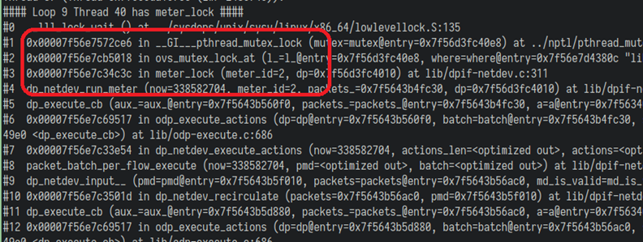
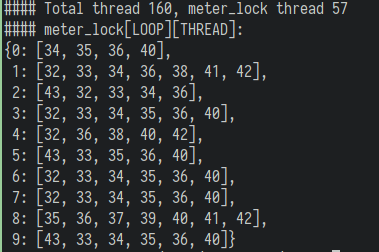

## DPDK网关性能瓶颈分析

### 背景

我们线上环境部署的基于Open vSwitch的DPDK技术实现的专线网关，前段时间遇到了用户特定业务流量导致
网关性能异常下降的问题。普通情况下，根据我们自己的测试结果，单台网关使用Intel/Mellanox 25G网卡，
测试流量打固定端口，单向转发性能可以达到900万以上的PPS，随机端口流量也可以达到500~600万的PPS。
但是当用户特定的业务流量走网关时，网关的转发性能会骤降到120万PPS左右，影响用户的线上业务。

在问题发生时，我们可以在网关观察到 ovs pmd 统计结果的 megaflow hits 和处理每个报文的cpu cycle
偏高：

### 问题重现

在问题出现后，我们迅速扩容了一批网关，第一时间先解决用户的性能需求。同时另外准备了一批测试机器，
尝试重现用户的问题。
通过准备的10台物理服务器和30台云主机，走网关模拟的用户的流量模型，经过各种尝试后，终于重现了
用户遇到的问题。

我们发现重现用户问题需要满足两个条件：

  * 大量TCP短连接
  * 网关处于高负载状态

我们在测试的机器上通过并发跑 netperf TCP_CRR 测试将网关打满，便可以重现这个场景。

### 问题分析

确认问题出现的场景后，我们团队提出了几个可能出现问题的地方：

  * Open vSwitch 的 EMC 缓存耗尽，报文转发走了效率更低的路径
  * Open vSwitch 的 socket-mem 内存资源耗尽，申请内存导致了性能下降
  * 网卡队列的CPU core绑定/NUMA绑定出现了错误
  * 网卡驱动的问题，等等

对于ovs emc缓存耗尽的猜测，我们通过升级ovs版本、开启smc缓存，问题仍然存在，排除可能。
对于ovs socket-mem 不够大的猜测，我们通过修改ovs配置大幅增加其大小，问题仍然存在，排除可能。
对于网卡队列的cpu/numa绑定出错的猜测，我们确认了没有使用CPU超线程core、处理单侧流量的网卡队列的
pmd绑定在相同的numa节点上，排除可能。
对于网卡驱动可能有问题的猜测，我们测试了Intel和Mellanox的网卡，都存在相同的问题，也排除了可能。

猜测可能出现问题的地方都排除了可能，只能直接分析ovs的调用堆栈分析原因了。

首先我使用perf/flamegraph工具，绘制了60s ovs pmd线程的cpu火炬图。

可以看到大量的CPU时间都消耗在了pthread等锁的函数调用上，但是从火炬图还是无法确认具体原因。

于是我又编写了一个调试脚本，循环调用gdb打印ovs pmd线程的调用堆栈，看看从结果能不能找出头绪，
终于有了新发现！

从我们脚本的统计结果可以看到，超过三分之一的ovs pmd线程都处于 meter_lock 这个锁函数上，
原因应该就是这里了，也就是ovs的meter功能导致的问题。

我们在测试网关上配置了跳过ovs meter的流表，网关性能瞬间恢复了正常。

由于线上的网关基本都是用户独占使用，关闭ovs meter(qos)功能并不会影响用户的实际使用，
为了快速解决线上的这个问题，我们迅速开发了跳过ovs meter的api开关以解决用户网关的这个问题。

对于ovs，可能是由于代码实现、性能优化不到位导致了这个问题，有待我们继续对ovs源码进行分析。
