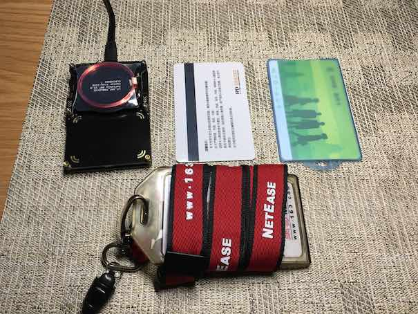

## 记一次简单的门禁卡破解尝试

(本文涉及内容仅为技术学习研究目的，请勿用于非法用途)

### 前言

十多天前的一个周末，我穿着睡衣拖鞋下楼扔垃圾。当刚出单元门听到“砰”的一声锁门声时，我就意识到自己回不了家了————小区的单元门需要刷门禁卡才能开门，然而我忘记带了。

在寒风中瑟瑟发抖了几分钟后，我便决心回家以后尝试破解一下这个门禁卡，毕竟每次都要用门禁卡开门实在是很不方便，这个东西太容易忘记随身带了，如果能直接用手机替代就很方便了。

工欲善其事，必先利其器，想要破解门禁卡，必须要有专业的设备才可以，这时我只大概了解这种非接触的门禁卡使用的是一种叫 "RFID"（无线射频识别）的技术。
在 youtube 上搜索一下 "RFID hacking"，发现很多无线安全相关的会议、演讲都在使用一个叫 proxmark3 的设备来调试 RFID，刚好某宝上搜一下发现也有这个设备卖，于是本文的主角便登场了———— Proxmark3。

本文后面所做的所有门禁卡调试、破解、复制的尝试，都是通过 Proxmark3 实现的。

### RFID 简介

RFID（Radio Frequency Identification），中文翻译为射频识别，又称无线射频识别，是一种通信技术，可通过无线电讯号识别特定目标并读写相关数据，而无需识别系统与特定目标之间建立机械或光学接触。
目前RFID技术应用很广，如图书馆、门禁系统、停车场等，安卓手机上常用的 NFC 技术实际上也是 RFID的一个子集。

RFID 按照工作频率的不同，可以分为低频（LF）、高频（HF）、超高频（UHF）等不同种类。目前国际上广泛采用的频率分布于4种波段，低频（125KHz）、高频（13.54MHz）、超高频（850MHz～910MHz）和微波（2.45GHz）。

本文重点讨论的 RFID 卡片，根据所使用的不同技术标准，主要集中在低频和高频。

### Proxmark3 简介

Proxmark3 是由 Jonathan Westhues 设计并且开发的开源硬件，其主要功能是用做 RFID 的嗅探、读取以及克隆等操作。

Proxmark3 是个开源硬件，其硬件设计及配套的软件是完全开源的，可以在 Github[1] 上找到。
如果你动手能力足够强，完全可以自己按照开源的设计方案从头组装甚至魔改一个 Proxmark3（实际上在 youtube 上能看到很多国外的同学已经这么实践了）。像我这样没有集成电路制作经验的手残，还是老老实实买现成的吧。

一个 Proxmark3 通常由高频天线、低频天线、FPGA 集成电路板等组件构成，一般和一个 iPhone差不多大小；通过 usb 连接到电脑，可以通过电脑刷写固件、bootloader 以及运行客户端命令行执行各种操作。

[1]: https://github.com/Proxmark/proxmark3

### 卡片介绍

在前面提到的门禁卡，实际上就是 RFID 卡片的一种。
在查了大量资料后，我将自己总结的常见的 RFID 卡片类型列举在下面。

* Mifare S50，简称 M1 卡；高频；最常见的卡，每张卡有唯一的 UID ，可存储修改数据，
  常见于饭卡、公交卡、门禁卡
* Mifare UID，简称 UID 卡；高频；M1 卡的中国特色版本，可以修改 UID，通常用来复制 M1 卡，
  在 Proxmark3 wiki 上被称作 "Magic Chinese card"
* EM4X，简称 ID 卡；低频；常见的低成本门禁卡，ID 唯一，只能读不能写
* T5577，简称可修改 ID 卡；低频；可修改 ID，常见的用来复制 EM4X 的卡片

根据查到的各方资料介绍，上面几种 RFID 卡片大概包括了全国使用卡片总量的 80%，另外还有一些更高端、使用更强加密算法的其他种类 RFID 卡片以及国内特色的各种 Mifare 兼容卡。

#### M1 卡

查询技术资料可以知道，M1 卡实际上就是一个微型 U 盘，一共有 16 个扇区(sector)，每个扇区有 4 个块(block)，每个块可以存储 16 bytes 的数据，一共可以存 1k 的数据。

每个扇区，前三个块用来存储数据，最后一个块存储这个扇区的密钥。

另外第一个扇区的第一个块比较特殊，用来存储这张卡的 UID 数据。

#### EM4X 卡

EM4X 卡就比较简单，没有什么数据存储和加密，只有一个简单的5字节 EM TAG ID 数据，即这张卡的 ID。

### 实战

设备和理论知识准备充足以后，就差动手了。待测试卡片：小区门禁卡、杭州公交卡、公司工牌。

> 下面程序输出中的如 UID 等敏感数据被我隐藏了

#### Proxmark3 准备

从 Github 官方主页下载最新源码，编译自己需要的固件、客户端版本，将固件通过 USB 更新到设备上。

我这里使用 MacBook 电脑，macOS 10.12.2 系统，根据官方 wiki 上提供的步骤比较容易地就成功更新了固件、安装客户端驱动。
但实际 Proxmark3 是全平台支持的，并且 Windows 系统的支持最好最全面，使用的人也最多。

    $ git clone https://github.com/Proxmark/proxmark3.git
    $ cd proxmark3
    $ brew tap nitsky/stm32
    $ brew install readline libusb p7zip libusb-compat wget qt5 pkgconfig arm-none-eabi-gcc
    $ brew link --force readline
    (可能需要调整 qt5 版本)
    $ export PKG_CONFIG_PATH=/usr/local/Cellar/qt5/5.6.1-1/lib/pkgconfig/
    $ export QT_PKG_CONFIG_QT5CORE=`find /usr -name Qt5Core.pc 2>/dev/null`
    $ chmod 666 $QT_PKG_CONFIG_QT5CORE
    $ echo "moc_location=\${prefix}/bin/moc" >> $QT_PKG_CONFIG_QT5CORE
    $ chmod 444 $QT_PKG_CONFIG_QT5CORE
    $ make clean; make

如果设备工作正常，可以在 /dev 下看到一个 cu.usbmodem 设备，使用客户端命令行工具连接 Proxmark3 并调谐天线。

    $ ./proxmark3 /dev/cu.usbmodem1421

    #db# Prox/RFID mark3 RFID instrument
    #db# bootrom: /-suspect 2015-04-02 15:12:04
    #db# os: /-suspect 2015-04-02 15:12:11
    #db# HF FPGA image built on 2015/03/09 at 08:41:42
    Prox/RFID mark3 RFID instrument

    uC: AT91SAM7S256 Rev B
    Embedded Processor: ARM7TDMI
    Nonvolatile Program Memory Size: 256K bytes. Used: 0 bytes ( 0). Free: 262144 bytes (100).
    Second Nonvolatile Program Memory Size: None
    Internal SRAM Size: 64K bytes
    Architecture Identifier: AT91SAM7Sxx Series
    Nonvolatile Program Memory Type: Embedded Flash Memory

    proxmark3> hw tune

    Measuring antenna characteristics, please wait........
    # LF antenna: 32.45 V @   125.00 kHz
    # LF antenna: 27.64 V @   134.00 kHz
    # LF optimal: 35.89 V @   127.66 kHz
    # HF antenna: 29.28 V @    13.56 MHz
    Displaying LF tuning graph. Divisor 89 is 134khz, 95 is 125khz.

上面可以看到调谐结果及高频/低频天线的空载工作电压。

#### 门禁卡识别

将小区门禁卡放在 Proxmark3 上后，尝试执行高频卡识别命令

    proxmark3> hf 14a reader
     UID : a4 68 xx xx
    ATQA : 00 04
     SAK : 08 [2]
    TYPE : NXP MIFARE CLASSIC 1k | Plus 2k SL1
    proprietary non iso14443-4 card found, RATS not supported
    Answers to chinese magic backdoor commands: NO

从结果可以看到这张卡片已经被正确识别出，UID 即为卡片的 ID 数据。

`TYPE : NXP MIFARE CLASSIC 1k` 结果表示这是一张 M1 卡

最后一行为 NO 表示这不是一张 UID 卡。

#### 门禁卡破解

想要破解 M1 卡片，关键是获得其 16 个扇区每个扇区的密钥，既而就可以获得 16 个扇区内存储的完整数据。有了卡片的完整数据后，想模拟、复制、修改卡片数据都可以，想怎么玩都可以。

Proxmark3 集成了几种比较高效的 M1 卡片密钥破解的方式：
* Darkside 攻击，获得 0 号扇区密钥
* 嵌套认证攻击，从已知扇区密钥计算未知扇区密钥，通常和 Darkside 配合使用
* 常见预设密钥穷举

我们这边里用 Darkside + nested authentication attack 的方式

    proxmark3> hf mf mifare
    p1:0 p2:0 p3:0 key:ffffffffffff
    p1:d9eb p2:1a4be p3:1 key:1d31575eb3b1
    key_count:2
    ------------------------------------------------------------------
    Found valid key:ffffffffffff

    proxmark3> hf mf nested 1 0 a ffffffffffff d
    Testing known keys. Sector count=16
    nested...
    Time in nested: 0.127 (inf sec per key)

    -----------------------------------------------
    Iterations count: 0

    |---|----------------|---|----------------|---|
    |sec|key A           |res|key B           |res|
    |---|----------------|---|----------------|---|
    |000|  ffffffffffff  | 1 |  ffffffffffff  | 1 |
    |001|  ffffffffffff  | 1 |  ffffffffffff  | 1 |
    |002|  ffffffffffff  | 1 |  ffffffffffff  | 1 |
    |003|  ffffffffffff  | 1 |  ffffffffffff  | 1 |
    |004|  ffffffffffff  | 1 |  ffffffffffff  | 1 |
    |005|  ffffffffffff  | 1 |  ffffffffffff  | 1 |
    |006|  ffffffffffff  | 1 |  ffffffffffff  | 1 |
    |007|  ffffffffffff  | 1 |  ffffffffffff  | 1 |
    |008|  ffffffffffff  | 1 |  ffffffffffff  | 1 |
    |009|  ffffffffffff  | 1 |  ffffffffffff  | 1 |
    |010|  ffffffffffff  | 1 |  ffffffffffff  | 1 |
    |011|  ffffffffffff  | 1 |  ffffffffffff  | 1 |
    |012|  ffffffffffff  | 1 |  ffffffffffff  | 1 |
    |013|  ffffffffffff  | 1 |  ffffffffffff  | 1 |
    |014|  ffffffffffff  | 1 |  ffffffffffff  | 1 |
    |015|  ffffffffffff  | 1 |  ffffffffffff  | 1 |
    |---|----------------|---|----------------|---|
    Printing keys to binary file dumpkeys.bin...
    
可以看到最终计算出所有扇区的密钥都是很简单的 `ffffffffffff` ，据说大部分国产 M1 卡片都会使用这个密钥方便复制。

#### 门禁卡数据导出

有了所有扇区的密钥，我们就能将完整的门禁卡数据导出到硬盘上。

    proxmark3> hf mf dump
    |-----------------------------------------|
    |------ Reading sector access bits...-----|
    |-----------------------------------------|
    #db# READ BLOCK FINISHED
    #db# READ BLOCK FINISHED
    ...
    |-----------------------------------------|
    |----- Dumping all blocks to file... -----|
    |-----------------------------------------|
    #db# READ BLOCK FINISHED
    Successfully read block  0 of sector  0.
    #db# READ BLOCK FINISHED
    Successfully read block  1 of sector  0.
    #db# READ BLOCK FINISHED
    ...
    #db# READ BLOCK FINISHED
    Successfully read block  3 of sector 15.
    Dumped 64 blocks (1024 bytes) to file dumpdata.bin

观察这个 1k 大小的导出数据，发现它就是一张只有 UID 数据的空卡。

    $ ls -alh dumpdata.bin
    -rw-r--r-- 1 stanzgy 1.0K Dec 22 23:42 dumpdata.bin

    $ xxd dumpdata.bin
    00000000: a468 xxxx 9808 0400 6263 6465 6667 6869  .h......bcdefghi
    00000010: 0000 0000 0000 0000 0000 0000 0000 0000  ................
    00000020: 0000 0000 0000 0000 0000 0000 0000 0000  ................
    00000030: ffff ffff ffff ff07 8069 ffff ffff ffff  .........i......
    00000040: 0000 0000 0000 0000 0000 0000 0000 0000  ................
    00000050: 0000 0000 0000 0000 0000 0000 0000 0000  ................
    00000060: 0000 0000 0000 0000 0000 0000 0000 0000  ................
    00000070: ffff ffff ffff ff07 8069 ffff ffff ffff  .........i......
    ...
    000003c0: 0000 0000 0000 0000 0000 0000 0000 0000  ................
    000003d0: 0000 0000 0000 0000 0000 0000 0000 0000  ................
    000003e0: 0000 0000 0000 0000 0000 0000 0000 0000  ................
    000003f0: ffff ffff ffff ff07 8069 ffff ffff ffff  .........i......

对比之前读取出的 UID 数据，可以知道0号扇区开头的四个 bytes 就是其 UID。

#### 门禁卡复制

有了门禁卡的导出数据，忍不住就用 UID 卡复制一张试试。

这张 UID 卡我用同样的方法获得其密钥为 `ffffffffffff`

复制前，我们直接读取其0号扇区的数据观察一下

    proxmark3> hf mf rdsc 0 a ffffffffffff
    --sector no:0 key type:A key:ff ff ff ff ff ff

    #db# READ SECTOR FINISHED
    isOk:01
    data   : 24 44 33 06 55 08 04 00 12 13 14 15 16 17 18 19
    data   : 00 00 00 00 00 00 00 00 00 00 00 00 00 00 00 00
    data   : 00 00 00 00 00 00 00 00 00 00 00 00 00 00 00 00
    trailer: 00 00 00 00 00 00 ff 07 80 69 ff ff ff ff ff ff

可以发现这张 UID 卡本身的出厂 UID 为 24 44 33 06

写入上面门禁卡的数据

    proxmark3> script run dumptoemul.lua
    --- Executing: ./scripts/dumptoemul.lua, args''
    Wrote an emulator-dump to the file A46891C5.eml

    -----Finished

    proxmark3> hf mf eload A46891C5
    ................................................................
    Loaded 64 blocks from file: A46891C5.eml

    proxmark3> hf mf cload e

再读取一下0号扇区看看

    proxmark3> hf mf rdsc 0 a ffffffffffff
    --sector no:0 key type:A key:ff ff ff ff ff ff

    #db# READ SECTOR FINISHED
    isOk:01
    data   : a4 68 xx xx 98 08 04 00 62 63 64 65 66 67 68 69
    data   : 00 00 00 00 00 00 00 00 00 00 00 00 00 00 00 00
    data   : 00 00 00 00 00 00 00 00 00 00 00 00 00 00 00 00
    trailer: 00 00 00 00 00 00 ff 07 80 69 ff ff ff ff ff ff
    
可以发现这张 UID 卡的数据已经变的和前面的门禁卡完全一样了。

我下楼扔垃圾时顺手试了下这张 UID 卡，还真的能刷开小区单元门禁。

#### 公交卡识别

公交卡同样流程尝试读取了一下

    proxmark3> hf 14a reader
     UID : 34 3f xx xx
    ATQA : 00 04
     SAK : 39 [1]
     ATS : 14 78 80 a0 ...
           -  TL : length is 20 bytes
           -  T0 : TA1 is present, TB1 is present, TC1 is present, FSCI is 8 (FSC = 256)
           - TA1 : different divisors are NOT supported, DR: [], DS: []
           - TB1 : SFGI = 0 (SFGT = (not needed) 0/fc), FWI = 10 (FWT = 4194304/fc)
           - TC1 : NAD is NOT supported, CID is supported
           -  HB : 8f 00 48 54 12 07 04 34 3
	Answers to chinese magic backdoor commands: NO
    
可以发现公交卡同样是一张高频卡，这部分内容有点敏感就不在这里深入研究了。

#### 工牌识别

我厂的工牌经过两次尝试，发现是一张低频 EM4X 卡片。

    proxmark3> lf search
    Reading 30000 bytes from device memory

    Data fetched
    Samples @ 8 bits/smpl, decimation 1:1
    NOTE: some demods output possible binary
      if it finds something that looks like a tag
    False Positives ARE possible

    Checking for known tags:

    EM410x pattern found:

    EM TAG ID      : 0400F8xxxx
    Unique TAG ID  : 20001Fxxxx

    Possible de-scramble patterns
    HoneyWell IdentKey {
    DEZ 8          : 16318057
    ...
    Pattern Sebury : 65129 120 7929449  [0xFE69 0x78 0x78FE69]

    Valid EM410x ID Found!
    
EM4X 卡片并没有什么加密与数据存储的功能，非常像一个“条形码”，输出中的 `EM TAG ID` 即为我们关心的 ID 信息。

### 小结

这次折腾 RFID 卡片，是一个非常有意思的过程，同时也深刻感受到目前大部分场合下使用的 RFID 卡片的不安全性。想到自己家里的房门也是支持通过 RFID 卡片刷卡开门，虽然没有开启这个功能，还是有点后怕，也希望能通过这篇文章提高大家这方的安全意识。

本文在这里折腾的这张“小区门禁卡”，应该是最简单也是目前社会上最常见的 RFID 卡片之一了，所以破解起来非常简单。其实还有很多使用更加先进加密技术的 RFID 卡片，有一定的安全保障，破解起来也会更加有意思和难度。

比较遗憾的是自己手里没有可以 root 的安卓手机，理论上支持 NFC 功能的安卓手机 root 后是可以模拟一张高频 M1 卡片的。大家感兴趣可以自己试试，也欢迎勘误和与我交流。
